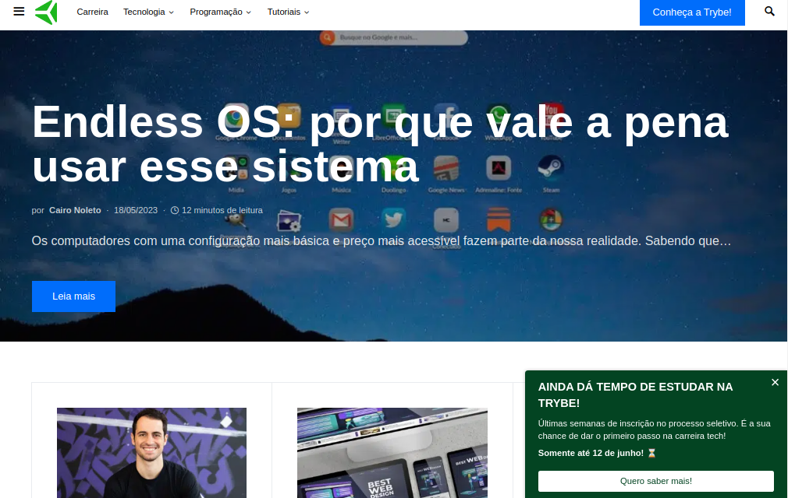
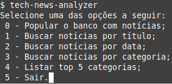

# bem vindo ao Crawler_Python-tech_news
Este projeto é um crawler que fiz usando python, usado durante o curso de formação no da Trybe.

Este crawler irá entrar no blog da trybe(https://blog.betrybe.com/) e copiar as noticias presentes nele para o banco de dados em mongoDB.
    

Para a realização deste projeto, utilizaremos um banco de dados chamado tech_news. As notícias serão armazenadas em uma coleção chamada news. Já existem algumas funções prontas no arquivo tech_news/database.py que te auxiliarão no desenvolvimento. Não altere as funções deste arquivo; mudanças nele não serão executadas no avaliador automático.

Rodar MongoDB via Docker: docker-compose up -d mongodb no terminal. Para mais detalhes acerca do mongo com o docker, olhe o arquivo docker-compose.yml

Caso queira instalar e rodar o servidor MongoDB nativo na máquina, siga as instruções no tutorial oficial:

Ubuntu: https://docs.mongodb.com/manual/tutorial/install-mongodb-on-ubuntu/ MacOS: https://docs.mongodb.com/guides/server/install/

Com o banco de dados rodando, o nosso módulo conseguirá acessá-lo sem problemas. Importe o módulo tech_news/database.py e chame as funções contidas nele. Lembre-se de que o mongoDB utilizará por padrão a porta 27017. Se já houver outro serviço utilizando esta porta, considere desativá-lo.

**A aplicação**
A aplicação se desenrola toda no terminal usando command-line interface(CLI) e toda a aplicação usa.

Inicie o ambiente virtual para rodar a aplicação, na pasta da aplicação abra o terminal e digite:
`source .venv/bin/activate`

A aplicação inicia com o <strong>menu</strong> ao realizar o comando:
`tech-news-analyzer`
    
- o usuario deverá digitar um numero de 1 a 5 e apertar a tecla `enter`.
    
# Orientações de INSTALAÇÃO DO PROJETO

  1. Clone o repositório
  - Entre na pasta que deseja instalar no terminal.
  - Use o comando: `git clone git@github.com:th-maia/Crawler_Python-tech_news.git`.
  - Entre na pasta do repositório que você acabou de clonar:
    - `cd Crawler_Python-tech_news/`

  2. Rode o ambiente virtual da aplicação.
    `source .venv/bin/activate`
  
  3. levante o banco de dados em mongoDB com `docker-compose up -d mongodb`

  4. rode o comando para iniciar a aplicação: `tech-news-analyzer`.

  5. feche o docker com o `docker-compose down`

